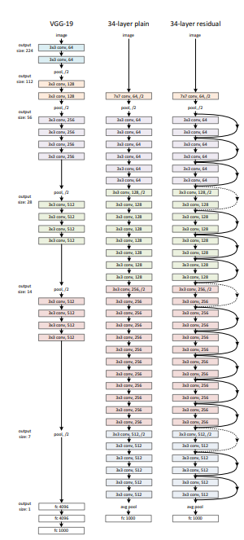
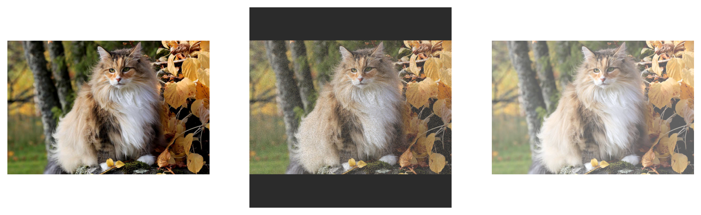
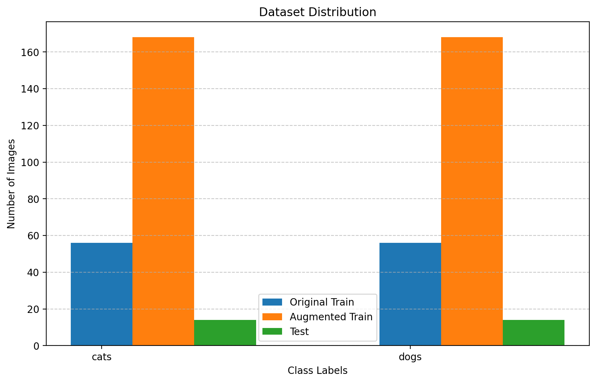
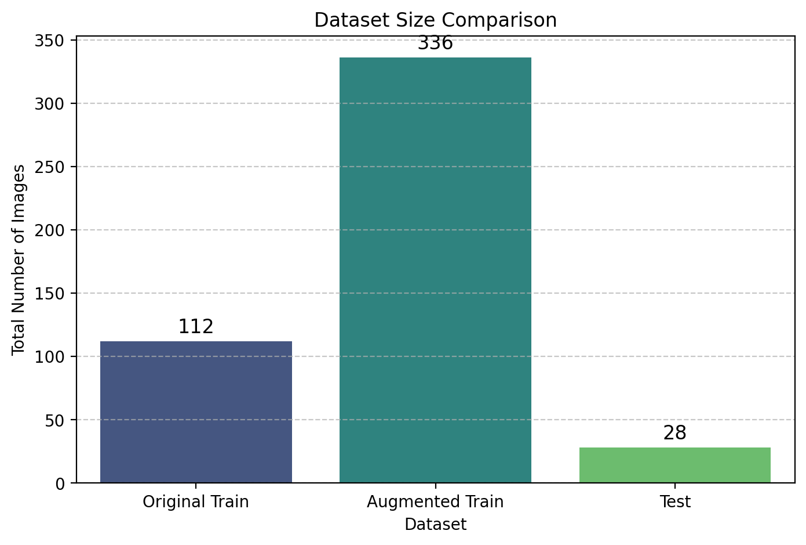
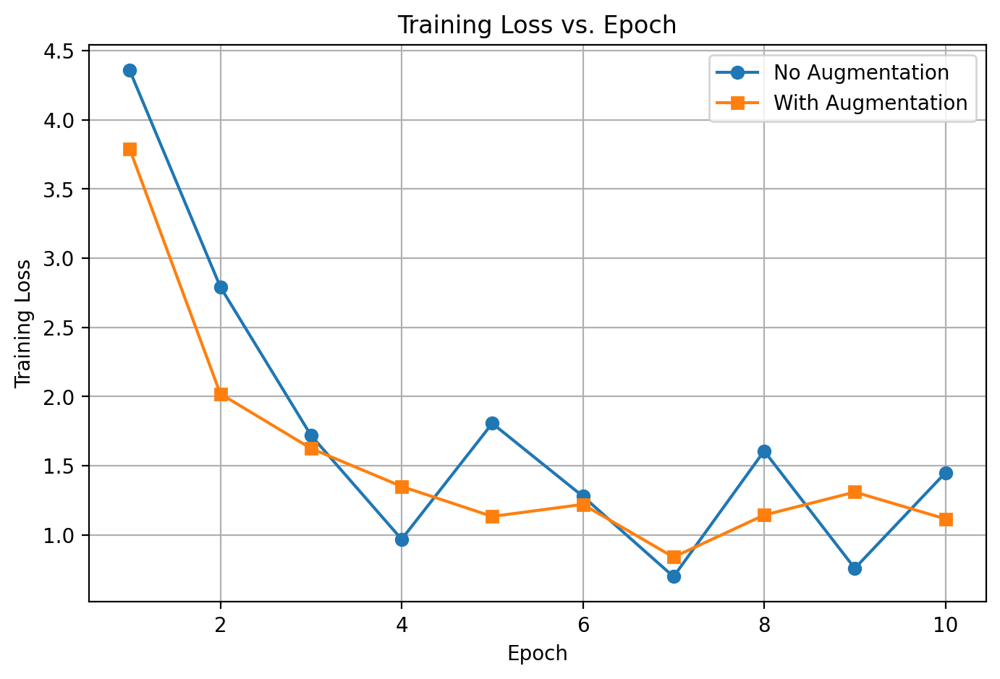

# Cat vs. Dog Classification with Data Augmentation

This repository demonstrates how data augmentation can improve the performance of a binary image classifier (Cats vs. Dogs) using the ResNet-50 model.

### Resnet50 Model

---

## Data Details

- **Class Mapping:**  
  - Cats: 0  
  - Dogs: 1

- **Dataset Sizes:**  
  - Original Training Data: 112 images  
  - Augmented Training Data: 336 images  
  - Test Data: 28 images

---

## Augmentations Applied

- **Blur:** Applies a blur with a radius of 2  
- **Rotate:** Rotates images by a random degree between 0 and 20  
- **Brightness:** Adjusts brightness with a factor between 0.5 and 1.5  
- **Saturation:** Alters saturation  
- **Scale:** Scales images by a factor between 0.5 and 1.5  
- **Opacity:** Changes opacity with a level between 0.6 and 0.9  
- **Shuffle Pixels:** Randomly shuffles pixels with a factor between 0.05 and 0.2  
- **Padding:** Pads images to make them square  
- **Random Noise:** Adds random noise  
- **Color Jitter:** Applies color jitter with random brightness, contrast, and saturation adjustments

#### Example :

1: Shuffle Pixels -> Padding -> Opacity -> Done
2: Brightness -> Opacity -> Scale -> Done

---

## Plots

### Task 1: Data Augmentation Statistics

### Task 2: Model Training

- **Training Loss Curves:**  
  

## Evaluation Metrics

### Without Augmentation
- **Accuracy:** 0.5000  
- **Precision:** 0.5000  
- **Recall:** 1.0000  
- **F1 Score:** 0.6667

### With Augmentation
- **Accuracy:** 0.5357  
- **Precision:** 0.5185  
- **Recall:** 1.0000  
- **F1 Score:** 0.6829

---

## Explanation

The low accuracy is likely due to the limited amount of data (112 original training images and 28 test images) and inconsistent image quality.

Although augmentation increased the training size, some augmentations introduced unrealistic variations (e.g., random sizes and images with multiple cats) that may confuse the model. 

The perfect recall indicates nearly all dogs (class 1) are detected, but the low precision suggests many cats (class 0) are misclassified as dogs. Improving data quality and using more targeted augmentation strategies may enhance performance.

---
